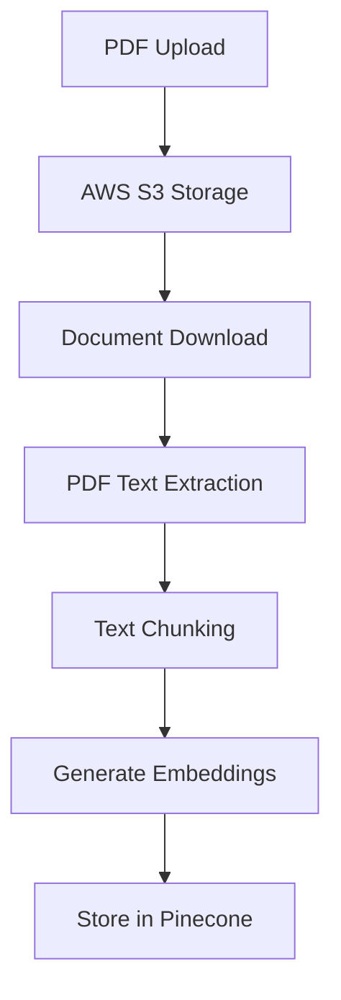
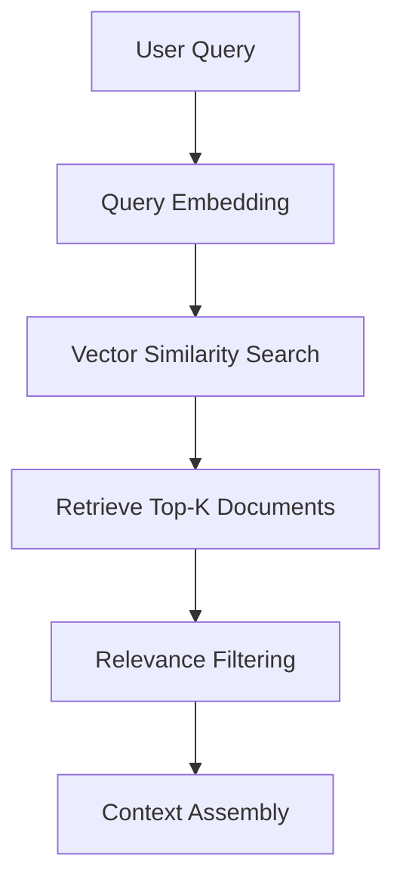
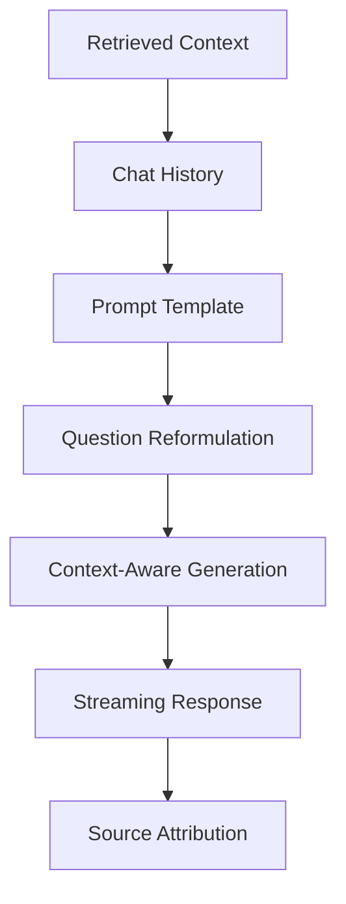

# Chat with PDF

A chat application which focuses on information retrieval by answering questions related to the provided PDF documents. The app utilises Langchain, OpenAI API and retrieval-augmented-generation (RAG) concept to generate responses that are deeply informed by the content within the PDFs as well as the context of the chat history.

## 🛠️ Tech Stack

- **FE & BE**: Next.js 14, React, TypeScript, Tailwind CSS
- **AI & ML**: OpenAI, LangChain, Vercel AI SDK
- **Database**: NeonDB (PostgreSQL), Drizzle ORM
- **Vector Database**: Pinecone
- **File Storage**: AWS S3
- **Authentication**: Clerk Auth

## 🧠 How the RAG (Retrieval-Augmented Generation) System Works

This application implements a sophisticated RAG pipeline that combines information retrieval with generative AI to provide accurate, source-based answers about PDF documents.

### 1. Document Ingestion Pipeline



**Process Details:**

- **File Upload**: PDFs are securely uploaded to AWS S3 with unique file keys
- **Text Extraction**: LangChain's PDFLoader extracts text content while preserving page metadata
- **Document Chunking**: RecursiveCharacterTextSplitter divides documents into 512-character chunks with 100-character overlap for context preservation
- **Vectorization**: OpenAI's `text-embedding-ada-002` model converts text chunks into high-dimensional vectors
- **Storage**: Embeddings are stored in Pinecone vector database with metadata (page numbers, file keys, original text)

### 2. Query Processing & Retrieval



**Process Details:**

- **Query Vectorization**: User questions are converted to embeddings using the same model
- **Similarity Search**: Pinecone performs cosine similarity search to find the most relevant document chunks
- **Relevance Filtering**: Only chunks with similarity scores > 0.7 are considered relevant
- **Context Limiting**: Retrieved context is truncated to 3000 characters to fit within model limits

### 3. Response Generation



**Process Details:**

- **Question Reformulation**: LangChain creates standalone questions from conversational context
- **Prompt Engineering**: Structured templates ensure the AI stays grounded in retrieved content
- **Contextual Generation**: GPT generates responses using both retrieved documents and chat history
- **Source Tracking**: Page numbers and original text snippets are preserved for citation
- **Real-time Streaming**: Responses are streamed to provide immediate user feedback

## 🚀 Getting Started

### Prerequisites

- Node.js 18+ or Bun runtime
- PostgreSQL database (NeonDB recommended)
- AWS S3 bucket
- Pinecone account
- OpenAI API key
- Clerk authentication setup

### Installation

1. **Install dependencies**

   ```bash
   npm install
   # or
   bun install
   ```

2. **Set up the database**

   ```bash
   npm run db-push
   ```

3. **Start the development server**

   ```bash
   npm run dev
   # or
   bun dev
   ```

4. **Open your browser**
   Navigate to `http://localhost:3000`
